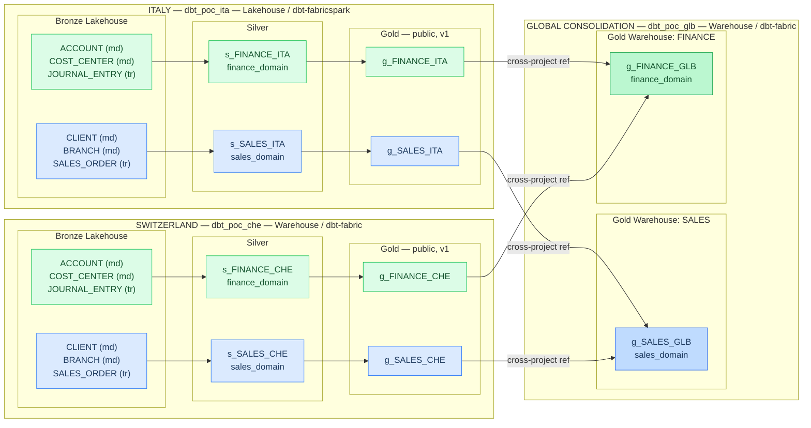

# OneData | dbt Cloud — POC Requirements Brief

---

## 🎯 Vision — *"dbt Cloud as the missing glue to execute and govern OneData at scale"*

## 👥 Contacts

<table>
  <colgroup>
    <col style="width:18%">
    <col style="width:18%">
    <col style="width:16%">
    <col style="width:48%">
  </colgroup>
  <thead>
    <tr><th>Name</th><th>Role</th><th>OneData Team</th><th>Responsibility</th></tr>
  </thead>
  <tbody>
    <tr><td>Guillaume Berthier</td><td>Senior Architect</td><td>Architecture</td><td>Architecture decisions, adapter and mesh design validation, Fabric workspace and access provisioning</td></tr>
    <tr><td>Orges Mezini</td><td>SCRUM Master</td><td>Squad Italy</td><td>dbt expert, coordination with dbt Labs, solution architecture and technical onboarding</td></tr>
    <tr><td>Kevin Groves</td><td>Principal Architect</td><td>Architecture</td><td>Architecture governance, final acceptance, executive demo sign-off</td></tr>
  </tbody>
</table>

---

## Table of Contents

1. [POC Purpose](#1-poc-purpose)
2. [Strategic Benefits to Showcase](#2-strategic-benefits-to-showcase)
3. [Architecture Overview](#3-architecture-overview)
4. [Scope of Work](#4-scope-of-work)
5. [Technical Constraints and Adapter Notes](#5-technical-constraints-and-adapter-notes)
6. [Acceptance Criteria](#6-acceptance-criteria)
7. [Timeline](#7-timeline)

---

## 1. POC Purpose

The OneData Program is commissioning a Proof of Concept to demonstrate how **dbt Cloud** can serve as the transformation and governance backbone for a multi-country, multi-domain data platform built on **Microsoft Fabric**.

**Audience:** OneData senior leadership and executives, via staged live demos.

**Demo philosophy:**

- Show it live in the platform — not on a slide
- Use business language — not engineering jargon
- Make the system walkable by non-technical stakeholders

**Key emphasis areas:**

- **Catalog and collaboration** — unified view of data assets, documentation, lineage, and quality beyond the engineering team
- **Dual-domain coverage** — Sales and Finance across Italy and Switzerland, with a global consolidation layer — demonstrating domain-level filtering and governance
- **Dual-adapter proof** — `dbt-fabric` (Warehouse) and `dbt-fabricspark` (Lakehouse) side by side, proving dbt Cloud unifies transformation workflows across both Fabric compute engines

---

## 2. Strategic Benefits to Showcase

The POC must be designed and delivered so that each of the following benefits is **concretely demonstrable** during the management showcase. Each one must map to a live, walkable feature in the delivered POC — presented in business language, not engineering terminology. Wherever possible, **show it live in the platform rather than describe it in a slide**. The demo should feel like a guided tour of a working system — not a static presentation.

### 2.1 End-to-end platform visibility, governance, and domain control

#### 2.1.1 Full data lineage across all countries and domains

dbt Mesh provides end-to-end visibility into how data flows and transforms across every country project. The demo must show a stakeholder tracing any figure in the global gold layer back to its country-level source, across project boundaries, in a single lineage view — spanning both Lakehouse-backed (Italy) and Warehouse-backed (Switzerland) projects, and across both the Sales and Finance domains.

#### 2.1.2 Bi-directional impact analysis

In a multi-country, multi-domain platform, every change carries risk. A schema change in a country-level model can silently break global consolidation; a new business rule at the global level may require changes in every country project. dbt Mesh, combined with model contracts and the dbt Cloud lineage graph, enables **bi-directional impact analysis** — the ability to assess the consequences of any change before it is deployed, in both directions:

- **Downstream (forward-looking):** "If I change the Italy sales gold model, what breaks?" — the lineage graph shows every model, test, and exposure that depends on it, across all projects in the mesh. A domain lead can see at a glance whether the global consolidation, a dashboard, or another country's reference is affected.
- **Upstream (root-cause):** "The global finance KPI moved unexpectedly — where did the change come from?" — the lineage graph traces back through the consolidation layer, through country gold and silver, all the way to the bronze sources, identifying exactly which transformation or source changed.

Model contracts reinforce this by making impact analysis enforceable. When a country gold model is declared with an explicit contract (enforced schema, column types, and constraints), any breaking change is caught automatically at build time — before it reaches downstream consumers. The global project does not need to run its own tests to discover that a country model changed shape; the contract does it.

The demo must show a concrete scenario: a developer introduces a breaking change to a country gold model (e.g., renaming or removing a column), and the platform catches the contract violation, surfaces the affected downstream models in the lineage graph, and blocks the deployment — all visible in the dbt Cloud interface without requiring the viewer to read code or logs.

#### 2.1.3 Domain and squad teams can oversee and steer their developers

Domain leads, squad teams, and Scrum Masters get a unified view of what is being built across countries and projects. The demo must show how a non-technical domain lead or Scrum Master can use the dbt Cloud interface to understand project status, model dependencies, and transformation coverage — without reading code.

#### 2.1.4 Domain-level filtering and selective execution via tags

dbt natively supports domain-style tags on any resource (models, sources, seeds, snapshots). The POC uses two business domains — **Sales** and **Finance** — tagged consistently across all three projects. The demo must showcase:

- **Catalog filtering by domain:** In dbt Cloud's Catalog (the multi-project lineage view), a stakeholder can filter all assets by tag — isolating the full `sales_domain` lineage from `finance_domain` in a single click. This is particularly powerful with dbt Mesh because the cross-project lineage is fully visible in the Catalog as long as you have read access to all projects. The demo should show a domain lead viewing only their domain's assets across all countries and the global consolidation, without noise from other domains.
- **Selective job execution:** dbt Cloud jobs can be scoped by tag, meaning the platform can run only the Sales pipeline or only the Finance pipeline on demand. The demo should show how this enables independent scheduling, faster iteration per domain, and targeted reruns when issues are detected — without rebuilding the entire platform.

This capability gives domain owners a sense of control and ownership over their slice of the data platform, even within a shared infrastructure.

### 2.2 Built-in data quality and trust with data contract enforcement

dbt enforces automated testing at every transformation step, so issues are caught before data reaches dashboards. The demo must include concrete test examples (validation rules, data quality assertions, contract enforcement) and show what happens when a test fails — including how failures surface in dbt Cloud's interface for both developers and non-technical stakeholders.

### 2.3 Accelerated convergence toward the data domains canonical model

dbt Mesh's cross-project referencing allows each country to build independently while progressively adopting shared, certified models. The demo must show how the global project references country gold models via cross-project dependencies, and how model contracts and versioning enable safe, incremental convergence — without requiring a "big bang" migration.

### 2.4 Analysts can provide structured feedback on what developers build

dbt Cloud includes collaboration features that allow business analysts to review, comment on, and validate the logic behind data models. The demo must show the feedback loop between a business analyst reviewing a model's documentation and a developer acting on that input.

### 2.5 A single source of documented business logic — and its path to the Purview Enterprise Catalog

Business rules (KPIs, definitions, calculations) live inside dbt as documented, version-controlled logic — not scattered across spreadsheets, emails, or tribal knowledge. Data engineers and data analysts author and maintain this documentation as part of their daily work: every model description, column definition, business glossary tag, ownership label, and test assertion is captured directly in the dbt project. The demo must show the dbt catalog generated from the POC projects, with model descriptions, column-level documentation, domain tags, and cross-project lineage navigable by a non-technical stakeholder.

This is also why dbt Cloud is the natural **authoring layer** for the enterprise data catalog. Maintaining asset documentation manually in Microsoft Purview is not sustainable at scale — descriptions, glossary terms, ownership, and lineage go stale the moment the underlying data changes, and in a multi-country, multi-domain platform that happens constantly. The OneData Program needs a model where documentation is authored once, at the source of truth — inside dbt — and then flows automatically into Purview so that the enterprise catalog is always current without manual intervention.

**A native dbt Cloud ↔ Microsoft Purview integration is not available today.** However, dbt Labs and Microsoft are actively investing in closer integration across the Fabric and dbt ecosystems. In the interim, integration is achievable through the **Purview Apache Atlas REST API**: a pipeline reads dbt's generated artifacts and pushes metadata into Purview programmatically. The dbt artifacts that feed this integration are:

- **`manifest.json`** — model and source definitions, table and column descriptions, tags, meta properties, domain classification, ownership, test definitions, and the full cross-project lineage graph
- **`catalog.json`** — materialized table schemas, column data types, row counts, and table-level statistics for every asset dbt has built
- **`run_results.json`** — test pass/fail results, execution timing, and freshness check outcomes

Once in Purview, these assets surface as table and column descriptions, business glossary terms, data quality indicators, ownership and domain classification, downstream exposures (dashboards, reports), freshness signals, and a fully connected cross-project lineage map. This positions dbt Cloud as the place where knowledge is created and Purview as the place where the entire organization discovers and governs it.

**This integration is out of scope for the POC**, but must be referenced in the demo narrative as a planned next step. dbt Labs should advise on any roadmap items or early-access programs that could accelerate this integration for The Adecco Group.

### 2.6 AI-powered data discovery and interaction

dbt exposes a **Model Context Protocol (MCP) server** that allows AI agents to query dbt metadata — lineage, model definitions, documentation, test results, and catalog content — through natural language. This capability can be integrated into **Microsoft 365 Copilot agents** and **Copilot Studio**, enabling business users to ask questions like:

- *"Where does the Global Sales KPI come from?"*
- *"Which country models feed into the consolidated revenue figure?"*
- *"Are there any data quality issues on the Switzerland Finance pipeline today?"*
- *"Who owns the customer master model and when was it last updated?"*

This transforms dbt Cloud from a tool used by engineers into an **enterprise knowledge layer accessible to anyone** through the AI assistants they already use daily. For the OneData Program, it means domain leads and executives can interrogate the data platform conversationally — without navigating technical interfaces or filing requests to the analytics team.

**This capability is out of scope for POC implementation**, but must be referenced in the demo narrative as a high-value integration on the roadmap. dbt Labs should advise on current MCP availability and any early-access programs relevant to The Adecco Group.

---

## 3. Architecture Overview

### 3.1 Topology

The POC implements a **medallion architecture** (bronze → silver → gold) across three dbt Cloud projects, **two business domains** (Sales and Finance), and **two Fabric adapters**, using **dbt Mesh** for cross-project orchestration.

- **Italy (dbt_poc_ita):** Fabric **Lakehouse** — `dbt-fabricspark` adapter (Spark / Livy)
- **Switzerland (dbt_poc_che):** Fabric **Warehouse** — `dbt-fabric` adapter (T-SQL / TDS)
- **Global (dbt_poc_glb):** Fabric **Warehouse** — `dbt-fabric` adapter (T-SQL / TDS) — **two gold warehouses**, one per domain

### 3.2 Dual-adapter rationale

Running both adapters in the same POC demonstrates that the OneData Program is not locked into a single Fabric compute engine. Country teams can choose the engine that fits their workload — Spark for data engineering-heavy pipelines, Warehouse for T-SQL-native analytics — while the global consolidation layer consumes from both seamlessly through dbt Mesh. This is a critical message for senior leadership: flexibility without fragmentation.

### 3.3 Dual-domain rationale

Including two business domains (Sales and Finance) in the POC is essential to demonstrate that dbt Cloud's catalog, tagging, and job execution features work at the **domain level**, not just the project level. A single-domain POC would not be able to show how a domain lead filters their view of the platform, how jobs can be scoped to a domain, or how cross-domain dependencies surface in the lineage graph. Two domains is the minimum needed to make domain governance tangible in the demo.

### 3.4 Source entities

Per country, six source tables are available in a **bronze Lakehouse pre-provisioned** within each workspace:

| Domain   | Source table     | Type           | Description                        |
|----------|------------------|----------------|------------------------------------|
| Sales    | CLIENT           | Master data    | Customer master records            |
| Sales    | BRANCH           | Master data    | Branch / office hierarchy          |
| Sales    | SALES_ORDER      | Transactional  | Sales order line items             |
| Finance  | ACCOUNT          | Master data    | General ledger accounts            |
| Finance  | COST_CENTER      | Master data    | Cost center hierarchy              |
| Finance  | JOURNAL_ENTRY    | Transactional  | Financial journal entries          |

### 3.5 Key design decisions (to be validated with dbt Labs technical architect)

**Repository structure — two options:**

- **Option A — Mono-repo (recommended for the POC):** All three projects (`dbt_poc_ita/`, `dbt_poc_che/`, `dbt_poc_glb/`) live as subfolders in a single Git repository. Simpler CI/CD setup, faster iteration, full visibility for the dbt Labs team during the engagement. Suitable for the POC scope.
- **Option B — Multi-repo (mesh best practice at scale):** Each project in its own Git repository, connected via dbt Mesh's cross-project referencing and published artifacts. Closer to the production topology the OneData Program would adopt at G12 country scale. Higher CI/CD overhead for a 4-week POC.

dbt Labs should advise on the preferred option for this engagement.

**Medallion layer separation — two options:**

- **Option A — Schema-based:** Each Fabric item (Lakehouse or Warehouse) hosts bronze, silver, and gold as separate schemas within a single item. Simpler workspace topology, fewer items to manage.
- **Option B — Item-based:** Bronze, silver, and gold are separate Fabric items (i.e., three Lakehouses or three Warehouses per country workspace). Provides stronger isolation boundaries and independent lifecycle management.

dbt Labs should advise on the preferred option, taking into account the constraints of both the `dbt-fabricspark` and `dbt-fabric` adapters.

**Global gold — item-based domain separation:** The global consolidation workspace hosts **two separate Fabric Warehouses** — one for Sales and one for Finance. This demonstrates item-level domain isolation at the gold tier and enables the demo to show how domain-scoped jobs and catalog views map to distinct physical assets.

**dbt Mesh wiring:** Country gold models are declared with `access: public`, versioned, and tagged by domain. The global project declares both country projects as dependencies and references them via cross-project `ref()`.

**Domain tagging convention:** All models, sources, and tests are tagged with either `sales_domain` or `finance_domain`. This convention must be consistent across all three projects and used to drive both catalog filtering and selective job execution in the demo.

---

## 4. Scope of Work

### 4.1 In scope — dbt Labs delivers

| Deliverable | Description |
|---|---|
| **dbt Cloud environment** | dbt Labs hosts the POC on their own dbt Cloud instance. dbt Labs is free to recycle or extend any existing POC environment, provided the final deliverable meets all requirements below. |
| **3 dbt Cloud projects** | `dbt_poc_ita` (dbt-fabricspark), `dbt_poc_che` (dbt-fabric), `dbt_poc_glb` (dbt-fabric) — fully configured with environments, jobs, and schedules |
| **2 business domains** | Sales and Finance — with consistent `sales_domain` and `finance_domain` tags applied across all models, sources, and tests in all three projects |
| **Dual-adapter demonstration** | Both `dbt-fabricspark` (Lakehouse/Spark) and `dbt-fabric` (Warehouse/T-SQL) must be demonstrated as first-class citizens in the same mesh. This is a non-negotiable requirement. |
| **dbt Mesh configuration** | Project dependencies, model contracts, versioning, cross-project referencing between country and global projects — including cross-adapter references (Lakehouse gold consumed by Warehouse global) |
| **dbt models** | Bronze source definitions, silver transformation models, gold consumption models per country per domain; global consolidation gold models per domain |
| **Domain-scoped jobs** | dbt Cloud jobs configured to run by domain tag (e.g., `sales_domain` only, `finance_domain` only), demonstrating selective execution |
| **Data quality tests** | Validation rules, data quality assertions, and at least 2 custom assertions per project demonstrating contract enforcement |
| **Impact analysis scenario** | A documented, reproducible scenario where a breaking change to a country gold model is caught by contract enforcement, with downstream impact visible in the lineage graph |
| **Documentation and catalog** | Model descriptions, column-level documentation, domain tags, and business logic annotations sufficient to generate a compelling, executive-ready dbt catalog for the demo |
| **CI/CD pipeline** | Git-triggered pipeline with dbt Cloud — including a PR-triggered slim CI job and a merge-triggered production deployment |
| **Demo script** | A written walkthrough document mapping each of the strategic benefits (Section 2) to specific screens, features, and actions in the delivered POC — written in business language suitable for executive audiences |

### 4.2 Out of scope — OneData team provides

| Item | Status |
|---|---|
| **Microsoft Fabric workspaces** | Pre-provisioned by OneData team: `EMEA_GDP_POC_ITADBT`, `EMEA_GDP_POC_CHEDBT`, `EMEA_GDP_POC_GLBDBT` |
| **Fabric Warehouses and Lakehouses** | Pre-provisioned within each workspace per dbt Labs' specifications — including the bronze Lakehouse per country workspace and the two gold Warehouses (Sales, Finance) in the global workspace |
| **Bronze data** | Already available in the bronze Lakehouses — dbt Labs uses existing data as-is |
| **Service Principal(s)** | OneData team provisions Entra ID service principals and grants necessary workspace permissions |
| **Workspace Identity / MSI** | OneData team configures Managed Identity on workspaces as required by dbt Labs |
| **Fabric capacity** | Managed by OneData team — dbt Labs to communicate expected CU consumption for Spark sessions (Italy workspace) and Warehouse queries |
| **Microsoft Purview integration** | Not implemented in the POC — referenced in documentation and demo narrative as a planned capability (see Section 2.9) |
| **dbt MCP / AI agent integration** | Not implemented in the POC — referenced in demo narrative |

---

## 5. Technical Constraints and Adapter Notes

### 5.1 Adapter assignments

- **`dbt-fabricspark`** for `dbt_poc_ita` — Lakehouse target via Livy/Spark
- **`dbt-fabric`** for `dbt_poc_che` and `dbt_poc_glb` — Warehouse target via TDS/T-SQL
- Both adapters must be demonstrated in the final POC.

### 5.2 Authentication

Microsoft Entra ID — service principal with appropriate workspace roles. The OneData team will provide credentials. Workspace Identity (MSI) will be configured on request.

### 5.3 Cross-adapter mesh

The global project (`dbt-fabric` / Warehouse) must successfully reference gold models from the Italy project (`dbt-fabricspark` / Lakehouse) via cross-project referencing. dbt Labs must validate that this cross-adapter, cross-workspace pattern works and document any limitations or workarounds.

### 5.4 dbt-fabricspark — notable capabilities

The `dbt-fabricspark` adapter (used for the Italy project) offers several capabilities beyond standard table/view materializations that may be of interest for the POC or for the demo narrative. These are not mandatory deliverables, but dbt Labs is encouraged to showcase any of the following if they enrich the demo:

- **Materialized Lake Views (MLVs)** — Fabric-native materialization with automatic lineage-based refresh, built-in data quality constraints (drop or fail on mismatch), partitioning, and scheduled refresh via the Fabric Job Scheduler API
- **Cross-lakehouse writes** — A single dbt project can write to multiple Lakehouses using the `database` config on individual models, enabling clean medallion separation at the item level
- **Livy session reuse** — Persistent Spark sessions across dbt runs for faster development cycles
- **Schema-enabled Lakehouses** — Three-part naming (`lakehouse.schema.table`) with automatic schema detection
- **Fabric Environment support** — Custom Spark configurations via Fabric Environments

### 5.5 Git provider

To be agreed between dbt Labs and the OneData team during Week 1 onboarding.

---

## 6. Acceptance Criteria

The POC is accepted when all of the following conditions are met:

1. **All three dbt projects build successfully** in dbt Cloud — a full build completes without errors across `dbt_poc_ita` (Lakehouse), `dbt_poc_che` (Warehouse), and `dbt_poc_glb` (Warehouse), covering both Sales and Finance domains.
2. **Both adapters are demonstrated** — the POC visibly runs transformations on a Fabric Lakehouse via Spark (Italy) and on a Fabric Warehouse via T-SQL (Switzerland) within the same dbt Mesh.
3. **Both domains are tagged and filterable** — all models, sources, and tests carry consistent `sales_domain` or `finance_domain` tags, and dbt Cloud's Catalog allows filtering the multi-project lineage view by domain.
4. **Domain-scoped jobs execute correctly** — dbt Cloud jobs scoped by tag (e.g., `sales_domain` only) run successfully without triggering unrelated domain models.
5. **Cross-project, cross-adapter lineage is visible** in the dbt Cloud lineage graph — a viewer can trace `g_SALES_GLB` or `g_FINANCE_GLB` back through country gold, silver, and bronze sources in a single connected graph, spanning both Lakehouse and Warehouse projects.
6. **Impact analysis is demonstrable** — a breaking change to a country gold model (e.g., removing or renaming a column) is caught by contract enforcement, and the downstream impact is visible in the lineage graph without requiring the viewer to read code or logs.
7. **All data quality tests pass** — and at least one intentional failure scenario is documented and reproducible for demo purposes.
8. **Model contracts are enforced** — country gold models have explicit contracts, and a breaking change is demonstrably caught.
9. **dbt catalog is generated** — with model descriptions, column documentation, domain tags, and cross-project lineage navigable by a non-technical stakeholder.
10. **CI/CD pipeline is operational** — a PR triggers a slim CI build in dbt Cloud, and a merge to main triggers a production deployment.
11. **Demo script covers all strategic benefits** — each benefit listed in Section 2 maps to a concrete, walkable action in the POC. Purview integration and AI/MCP capabilities are covered as narrative only.

---

## 7. Timeline

| Week | Milestone |
|------|-----------|
| **Week 1** | Environment onboarding: dbt Cloud project setup, Git repo provisioned, Fabric workspace connectivity validated for both adapters, cross-workspace and cross-adapter identity confirmed |
| **Week 2** | Country projects delivered: `dbt_poc_ita` (Lakehouse/Spark) and `dbt_poc_che` (Warehouse/T-SQL) with sources, silver, gold models for both Sales and Finance domains, tests, tags, and documentation |
| **Week 3** | Global project delivered: `dbt_poc_glb` with cross-project mesh wiring, contracts, versioning, domain-scoped jobs. CI/CD pipeline operational. Cross-adapter lineage and impact analysis scenario validated end-to-end |
| **Week 4** | Demo preparation: dbt catalog polished, demo script written, domain-filtering and tag-scoped job demos rehearsed, impact analysis walkthrough finalized, dry-run with OneData team, defect remediation |

---

*This document defines the scope and requirements for the dbt Cloud POC. Any deviation from the architecture, tooling choices, or timeline must be discussed and agreed with the OneData team before implementation.*
